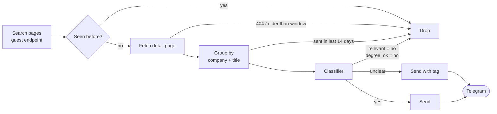

# MALJA

Messaging App LinkedIn Job Alerts. A bot that watches LinkedIn's public job search for new internship postings, screens each one with an LLM, collapses per-city clones of the same role, and posts every new match to a Telegram group. No LinkedIn login, no cookies. One Node process, one SQLite file, hosted on Railway.

Telegram is the first adapter behind a small notifier interface, so a WhatsApp or Discord adapter is an implementation away. The classifier is written for internships (it asks about a term, a graduation date, and a program); retargeting it to other roles is a prompt change, see [Make it yours](#make-it-yours).

## What lands in the group

One message per role. Each city links to its own posting. The last line only appears when the classifier has something to flag.

> **Software Engineer Intern**
> _Spectrum_
> [Greenwood Village, CO](https://www.linkedin.com/jobs/view/111) · [Englewood, CO](https://www.linkedin.com/jobs/view/222)
> ℹ️ eligibility unclear · no sponsorship

| Glyph | Meaning |
| --- | --- |
| ℹ️ | Degree eligibility unclear, or the posting says no visa sponsorship. |
| ⚠️ | US citizens only. The one tag that rules most of the group out. |

Postings the classifier marks as not relevant or not open to the configured degree are never sent. The admin chat gets a short line when something breaks (rate limited, blocked, classifier down, send failed, a cycle threw), at most once an hour per condition.

## How a cycle works

Every `pollIntervalSec` (default 5 min), for each search URL in config.json:

| Outcome | What it means |
| --- | --- |
| sent | New role, classifier said yes or could not tell. |
| sent with tag | Same, but degree eligibility is unclear or work authorization is restricted. |
| suppressed | Classifier said not relevant or wrong degree. Stored, never sent, and not blocked for a later clone. |
| stale | Detail page timestamp older than `recencySec`. Stored as seen. |
| gone | Detail page returned 404 or 410. Stored as seen. |
| deferred | Ran out of request budget this cycle. Picked up next cycle. |

Full step list in [docs/core/loop.md](docs/core/loop.md).

## Run it locally

Needs Node 24 and pnpm 10.

1. `pnpm install`
2. `cp .env.example .env` and fill it in. Point the group id at a private test group first.
3. `pnpm dev` runs `src/index.ts` under `node --watch` with pretty logs. `/health` is on port 3000.

| Variable | Required | Notes |
| --- | --- | --- |
| `TELEGRAM_BOT_TOKEN` | yes | From BotFather. |
| `TELEGRAM_GROUP_CHAT_ID` | yes | Where notifications go. Supergroups use a `-100` prefixed id. |
| `TELEGRAM_ADMIN_CHAT_ID` | yes | Your DM with the bot, for alerts. |
| `OPENROUTER_API_KEY` | yes | Put a monthly limit on the key; that is the spend cap. |
| `DATA_DIR` | no | Where `malja.db` lives. Default `./data`. |
| `CONFIG_PATH` | no | Alternate config.json for dev. Default `./config.json`. |
| `PROXY_URL` | no | A single residential proxy for LinkedIn requests, if the host IP keeps getting throttled. |

The rest are in [docs/core/config.md](docs/core/config.md). Two scripts hit real services without running the loop: `pnpm notify:test` sends one sample message, and `pnpm scrape` runs one search against LinkedIn and prints every request and job.

## Deploy

One Railway service built from the Dockerfile, one volume mounted at `/data`.

| Setting | Value |
| --- | --- |
| Volume | Mount at `/data`, set `DATA_DIR=/data`. The SQLite file is the only state. |
| `RAILWAY_RUN_UID` | `0`, so the container can write to the volume. |
| Healthcheck | `/health`, always 200 once listening; the body says `ok` or `stale`. |
| `config.json` | Baked into the image. A search change is a commit and a redeploy. |

Every variable, restart behaviour, and the first-deploy checklist: [docs/operations/deploy.md](docs/operations/deploy.md). Pausing is stopping the service; the store remembers what was sent.

## Make it yours

Everything that decides what gets found and who it is for lives in `config.json`.

| Key | What to put there |
| --- | --- |
| `searches[].url` | A LinkedIn job search URL pasted from the browser. Keywords, location, and filters all come from it. Add as many as you like. |
| `classifier.program` | Who the readers are, in prose. Goes into the prompt verbatim. |
| `classifier.graduation` | When they graduate, e.g. `"May 2028"`. Used to judge degree eligibility. |
| `classifier.term` | The term the searches target, e.g. `"summer 2027"`. A posting for another term is suppressed. |
| `classifier.fields` | The fields a posting must be in, in prose. |
| `classifier.model` | Any OpenRouter model id. Sets the cost per posting. |
| `recencySec` | How far back each search looks. Default one hour. |
| `pollIntervalSec` | Seconds between cycles. Default 300, floor 60. |
| `dedupe.windowDays` | How long a company + title pair stays quiet after a send. Default 14. |

Three things live outside that file:

- Chat ids and tokens are environment variables, so a test group is a matter of `.env`.
- A second messaging app implements the five-method notifier interface in `src/notifier/` and gets the same message data and tag levels. See [docs/notifier/interface.md](docs/notifier/interface.md).
- Full-time or non-internship roles need the relevance rule in `src/classifier/prompt.ts` changed and the eval set relabelled. See [docs/classifier/prompt.md](docs/classifier/prompt.md) and [docs/classifier/eval.md](docs/classifier/eval.md).

## Develop

| Script | Does |
| --- | --- |
| `pnpm test` | vitest, no network. Captured LinkedIn responses in `test/fixtures/`. |
| `pnpm lint` / `pnpm format` | Biome check / write. |
| `pnpm typecheck` | tsc over src and test. |
| `pnpm build` then `pnpm start` | Emit `dist/` and run it, same as the container. |
| `pnpm scrape --save-fixtures` | Refresh the fixtures from a live search. |
| `pnpm eval:classifier` | Run the labelled eval set through the real classifier. Costs money. |

CI runs lint, typecheck, test, and a Docker build. Docs are split by component: [scraper](docs/scraper/README.md), [classifier](docs/classifier/README.md), [notifier](docs/notifier/README.md), [core](docs/core/README.md), [operations](docs/operations/README.md).
